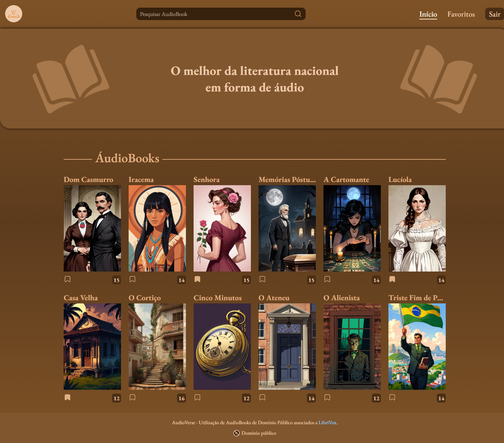
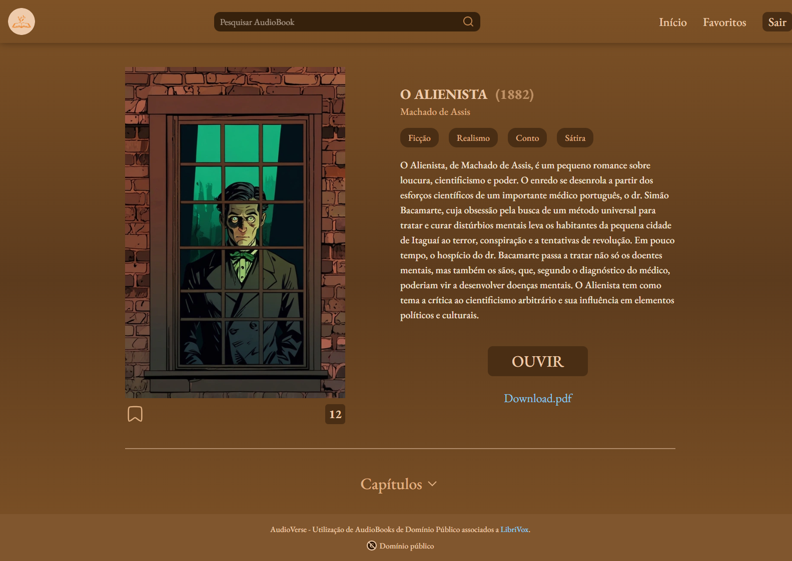
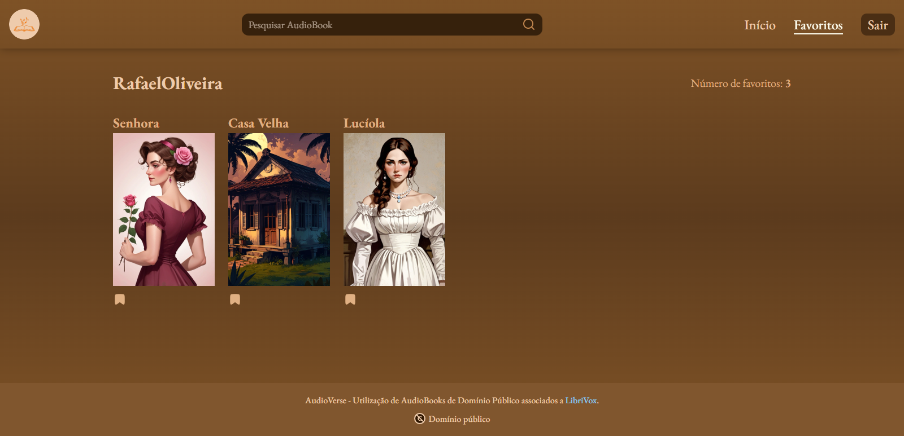
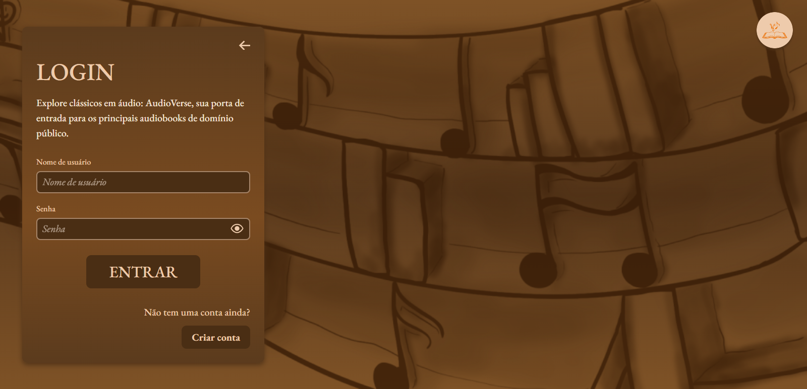
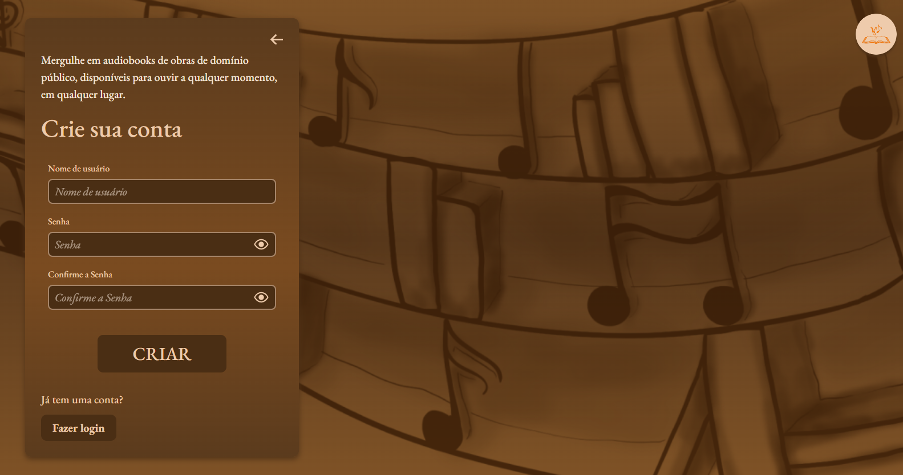

<h1 align="center">📘 AudioVerse 🎵</h1>

<p align="center">
  
</p>


<h3 align="center">Trabalho de conclusão de curso (TCC), na escola: ETEC Comendador João Rays, terceiro e último módulo do curso: Ensino Médio com Habilitação Profissional de Técnico em Informática para Internet. Professor: José Antonio Gallo Junior.<h3>

<br>

## Tópicos
- [Telas do projeto](#telas)
- [Executando o projeto](#execute)
- [Descrição](#desc)
- [Funcionalidades](#func)
- [Tecnologias utilizadas](#tec)
- [Status do projeto](#status)  
- [Desenvolvedores do projeto](#devs)
- [Licença](#license)

<br>

<h2 id="telas">🖼 Telas do projeto</h2>

<h3>Página inicial</h3>

<p align="left">
  
</p>

<br>

<h3>Página de leitura</h3>

<p align="left">
  
</p>

<br>

<h3>Página de favoritos</h3>

<p align="left">
  
</p>

<br>

<h3>Página de login</h3>

<p align="left">
  
</p>

<br>

<h3>Página de cadastro</h3>

<p align="left">
  
</p>

<br>

<h2 id="execute">📋 Executando projeto</h2>

<h3>Pré-requisitos</h3>

- [.NET 8.0](https://dotnet.microsoft.com/en-us/download/dotnet/8.0)
- [Node LTS](https://nodejs.org/en)

<h3>Passo a passo</h3>

```bash
...
```

<br>

<h2 id="desc">💾 Descrição</h2>

<p align="justify">
  O projeto é uma plataforma literária desenvolvida para divulgar a literatura brasileira através de audiobooks e PDFs que estão em domínio público. Os arquivos de áudio foram pegos do site <a href="https://librivox.org/" target="_blank">librivox</a> e os PDFs do site <a href="http://www.dominiopublico.gov.br/pesquisa/PesquisaObraForm.jsp">domínio público</a>.
</p>

<br>

<h2 id="func">⚙ Funcionalidades</h2>

* Criar conta
* Fazer login
* Sair da conta
* Ouvir audiobook
* Baixar arquivo de áudio do audiobook
* Baixar PDF do audiobook
* Favoritar audiobooks se estiver logado
* Pesquisar audiobook pelo título
* Tema claro/escuro com base nas configurações do SO

<br>

<h2 id="tec">🚀 Tecnologias utilizadas</h2>

* Figma
* Adobe Photoshop
* C#
* .NET
* Entity Framework
* Identity
* MySQL
* Docker
* HTML e CSS
* JavaScript
* React

<br>

<h2 id="status">🚧 Status dos projetos</h2>

⏳ Projeto em andamento

<br>

<h2 id="devs">👨‍💻 Desenvolvedores do projeto</h2>

* Design e Documentação: <a href="https://www.linkedin.com/in/rafaela-torelli-830686323/" target="_blank">Rafaela Alessandra Torelli</a>
* Back-End: <a href="https://github.com/Matheus-Bertolini" target="_blank">Matheus Nunes Bertolini</a>
* Front-End: <a href="https://github.com/Fel1324" target="_blank">Rafael Roberto de Oliveira</a>


<br>

<h2 id="license">📝 Licença</h2>

O projeto está sob a licença MIT.